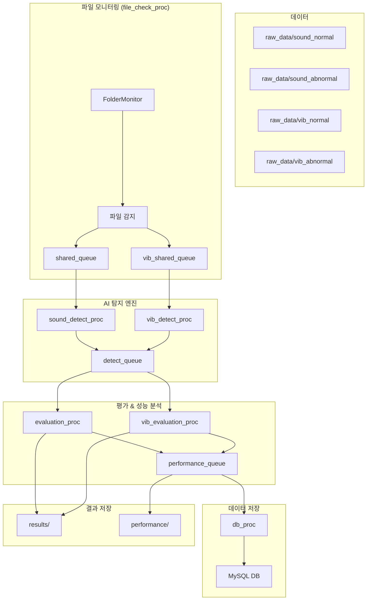
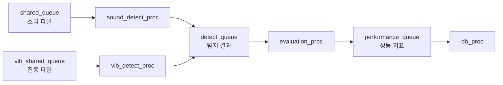
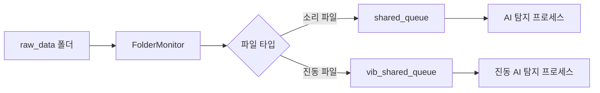
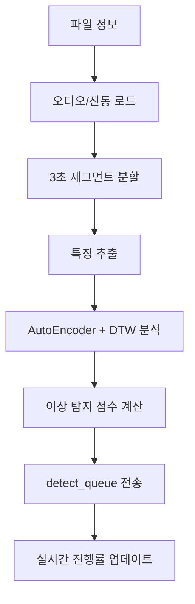
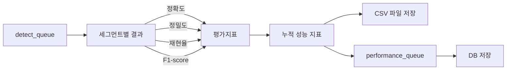

# manufacture_ai

### 전체 프로세스 아키텍처

```mermaid
graph TB
    subgraph "데이터"
        A[raw_data/sound_normal] 
        B[raw_data/sound_abnormal]
        C[raw_data/vib_normal]
        D[raw_data/vib_abnormal]
    end
    
    subgraph "파일 모니터링 (file_check_proc)"
        E[FolderMonitor] --> F[파일 감지]
        F --> G[shared_queue]
        F --> H[vib_shared_queue]
    end
    
    subgraph "AI 탐지 엔진"
        I[sound_detect_proc]
        J[vib_detect_proc]
        G --> I
        H --> J
        I --> K[detect_queue]
        J --> K
    end
    
    subgraph "평가 & 성능 분석"
        L[evaluation_proc]
        M[vib_evaluation_proc]
        K --> L
        K --> M
        L --> N[performance_queue]
        M --> N
    end
    
    subgraph "데이터 저장"
        O[db_proc]
        P[MySQL DB]
        N --> O
        O --> P
    end
    
    subgraph "결과 저장"
        Q[results/]
        R[performance/]
        L --> Q
        M --> Q
        N --> R
    end
```

## 큐 구조

```mermaid
graph LR
    A[shared_queue<br/>소리 파일] --> B[sound_detect_proc]
    C[vib_shared_queue<br/>진동 파일] --> D[vib_detect_proc]
    B --> E[detect_queue<br/>탐지 결과]
    D --> E
    E --> F[evaluation_proc]
    F --> G[performance_queue<br/>성능 지표]
    G --> H[db_proc]
```
 

## 실시간 처리 플로우

### 1단계 : 파일 모니터링

```mermaid
graph LR
    A[raw_data 폴더] --> B[FolderMonitor]
    B --> C{파일 타입}
    C -->|소리 파일| D[shared_queue]
    C -->|진동 파일| E[vib_shared_queue]
    D --> F[AI 탐지 프로세스]
    E --> G[진동 AI 탐지 프로세스]
```

### 2단계 : AI 탐지 처리

```mermaid
graph TD
    A[파일 정보] --> B[오디오/진동 로드]
    B --> C[3초 세그먼트 분할]
    C --> D[특징 추출]
    D --> E[AutoEncoder + DTW 분석]
    E --> F[이상 탐지 점수 계산]
    F --> G[detect_queue 전송]
    G --> H[실시간 진행률 업데이트]
```

### 3단계 : 평가 및 성능 분석

```mermaid
graph LR
    A[detect_queue] --> B[세그먼트별 결과]
    B --> |정확도|C[평가지표]
    B --> |정밀도|C[평가지표]
    B --> |재현율|C[평가지표]
    B --> |F1-score|C[평가지표]

    C --> D[누적 성능 지표]
    D --> E[CSV 파일 저장]
    D --> F[performance_queue]
    F --> G[DB 저장]
```
